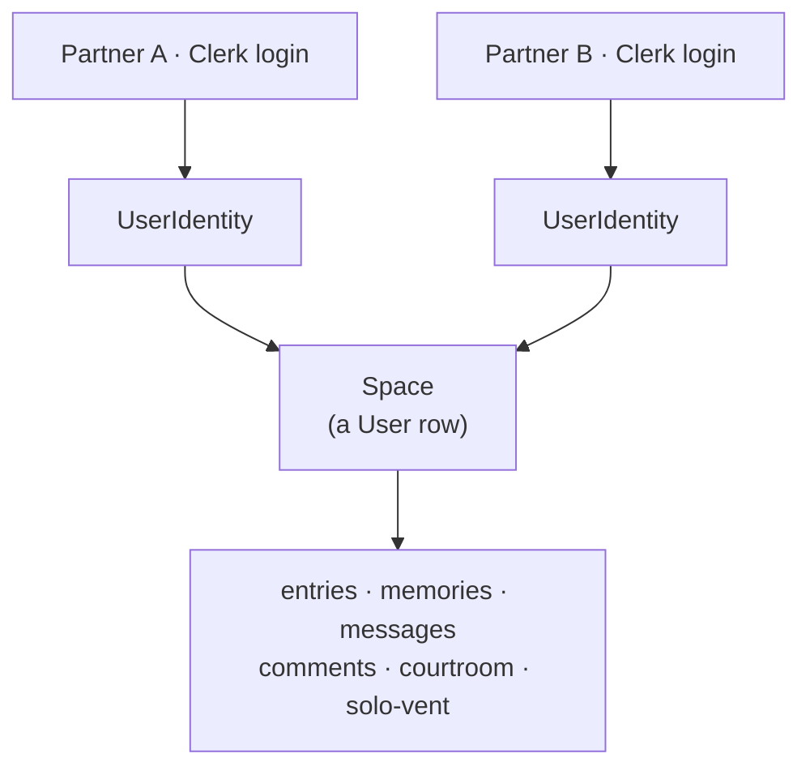
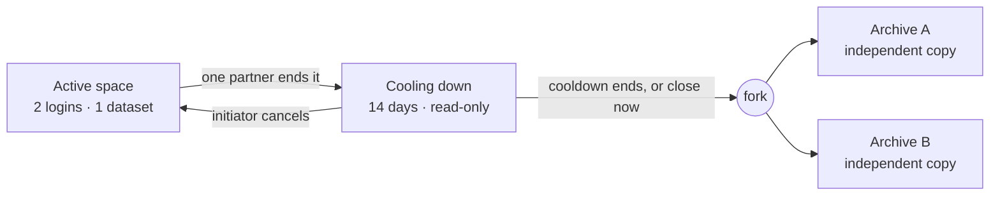

# Riceee

> A journal that two people own together — one shared dataset, not two accounts with a shared folder.

That distinction sounds small and isn't. The moment a single record belongs to
*both* people instead of one, software has to answer three questions it normally
never faces: **whose name is on this, what can stay private inside something
shared, and who keeps what when the two people split up.** Riceee is a couples
journal built around answering those three well.

Built solo — product, schema, backend, UI.

**Stack:** Next.js 16 · React 19 · PostgreSQL (Neon) + Prisma · Clerk · Pusher · Google Gemini · Cloudflare R2 · Arcjet · Tailwind · deployed on Railway.

---

## The model everything hangs off

A "space" isn't a user — it's a couple. All content hangs off one `User` row,
and two `UserIdentity` rows (two separate Clerk logins) point at it.



Every other decision in the codebase is downstream of this one. Start with
`lib/space-identity.js` and the rest follows.

---

## What it does

- **Journal** — rich-text entries with moods, drafts and collections, each signed by one partner or both.
- **Memories** — a shared photo vault on Cloudflare R2.
- **Riceee** — a Gemini-powered companion in two modes: *Solo Vent*, a private one-to-one chat your partner cannot see, and *The Courtroom*, where both sides of an argument go in and a calibrated verdict, fault split, and signable agreement come out.
- **Dashboard** — mood trends and writing streaks, bucketed by your own timezone.
- **Games** — ten real-time multiplayer games over Pusher WebSockets, including a live shared drawing canvas.
- **Ending a space** — a complete data-ownership flow for when a relationship ends.

---

## Three questions, and how the code answers them

### 1. Whose name is on this?

Entries store a **slot** — `hunter`, `riceee`, or `both` — never a display name.
The name is resolved at render time.

That indirection is the fix to a real bug: names are a setting, and when I
renamed a partner from *Praneeth* to *Hunter* during testing, every entry they'd
ever written became unattributed at once, because the app was matching stored
names against current ones. Slots are permanent; names float on top. See
`lib/constants/players.js`.

### 2. What can stay private inside something shared?

Solo Vent is the one thing in a shared space that *isn't* shared — it's where
you say the thing you can't say to your partner. It was keyed to the space
rather than the person, so both partners read the same list. Live data already
had a conversation titled **"She was wrong"** sitting one tap away from the
person it was about.

Conversations now carry an owner slot and every query filters on it. Deletes and
renames go through `deleteMany`/`updateMany` so ownership is *part of the match*,
never a check that could fall back to matching on id alone. The AI route needed
no change: it reads history from the request, and the only way to obtain history
is a query that's now scoped — so the other partner's venting can't reach the
prompt either.

### 3. Who keeps what when it ends?

The hardest part, and the part I put the most into. It assumes the realistic
case — one person ends it, the other may never log back in, or is angry — so
nothing waits on both people agreeing.



- **Export works at any time**, not only once you're closing — otherwise the only way to get your own history out is to announce you're leaving first, which is backwards for anyone who needs to leave quietly.
- **The cooldown is read-only.** Everything stays readable and downloadable; only new writing stops, so the app never becomes the thing that cuts someone off.
- **Only the initiator can cancel.** If either partner could, whoever wanted out could be held there forever by the other cancelling every time; the partner gets *"close it now"* instead, so the flow only moves forward.
- **The fork is a full deep copy into two independent archives.** Expensive, and it buys one specific thing: every model cascade-deletes from a single `userId`, so a *shared* archive would let one deletion wipe both people's entire history.
- **Solo Vent moves with its author** (copying it would hand each of them a record of being complained about), and **photos stay shared by reference** — the stored file is deleted only when the last archive stops pointing at it, so removing a photo from your copy can't blank it out of theirs.
- **`SpaceAccess` separates "the space I'm in" from "the spaces I may open,"** which is what lets someone start over with a new partner without their archive being a dead end that locks the account out of pairing forever.

Engine in `lib/space-closure.js`, guards in `lib/auth.js`.

---

## One more, because it was a real outage

Deleting a Clerk login and signing back up with the same Google account mints a
*new* `clerkUserId` while `User.email` (unique) still holds the old one. That
collision threw `P2002` inside the authenticated layout — which meant **every
signed-in route 500'd**, not just one page. The fix: when a verified email
already owns a space, adopt it and repoint ownership at the live account, rather
than trying to create a second row next to it. `lib/auth.js`.

---

## Running it

```bash
git clone https://github.com/imhunterr/Riceee.git
cd Riceee
npm install
```

Copy `.env.example` and fill it in. Two files by design: `DATABASE_URL` and
`GEMINI_API_KEY` go in `.env` (the Prisma CLI reads it directly), everything
else in `.env.local`.

```bash
npx prisma db push   # schema applied directly — no migration history to reconcile
npm run dev
```

The two-partner behaviour needs two accounts: sign in, generate a pairing code
in Settings, and redeem it from a second account in another browser.

---

## Layout

```
app/(main)/    the signed-in app; route-specific UI in each route's _components/
app/api/       export (streamed zip), the Gemini route, Pusher auth + trigger
actions/       server actions, one file per area — this is the backend
lib/           auth guards, space identity, the closure engine, integrations
prisma/        the schema — 15 models
```

Guards worth knowing, applied in the server actions rather than the UI:
`getWritableSpace` (refuses closing + archived spaces — all shared writing),
`getUnarchivedSpace` (refuses only archived — Solo Vent), and `getCurrentUser`
(refuses nothing — export, closure controls, removing your own photo, since
taking your own content down is a consent decision, not new writing).

---

Built by [Praneeth](https://github.com/imhunterr).
